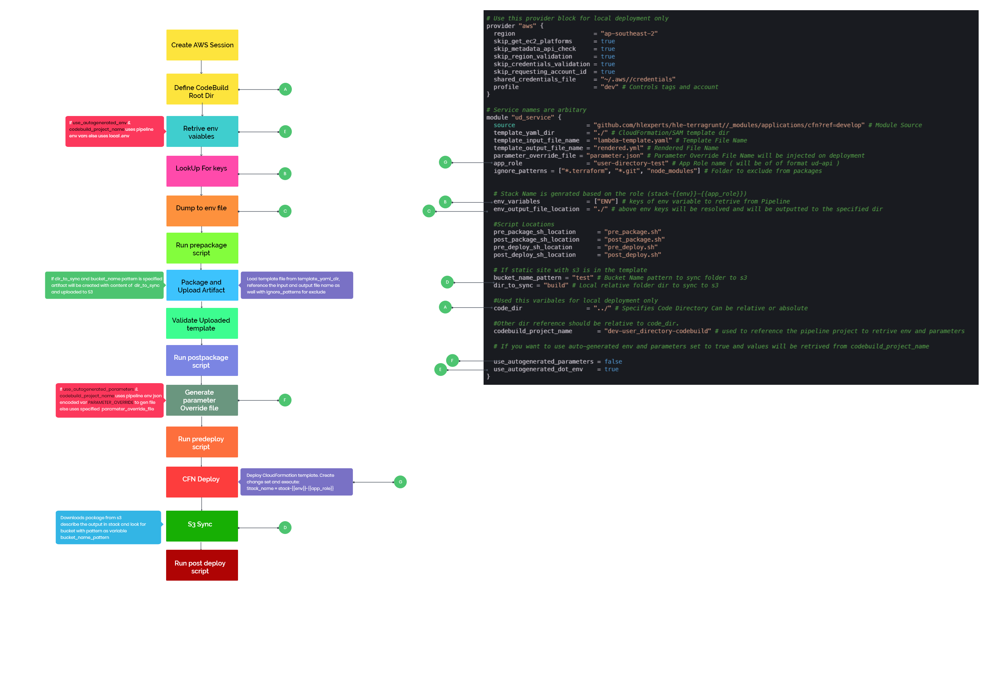

# Packaging and Deploying Cloudformation

Module packages and deploys the CloudFormation Projects.

### Prerequisites
- aws_cli ( aws-cli/2.2.5 or above)
- python3 (3.8.7 or above)
### Steps

- Package
- Validate
- Create ChangeSet
- Deploy

## Operation

### Modes

- Local
- Pipeline

**Pipeline**

When the module runs on AWS CodeBuild, it will use the environment variable set from the pipeline.
For CFN parameter override it will use the environment variable (JSON encoded) `PARAMETER_OVERRIDE`. It will decode the env and create a file with parameter override with the file name specified in `parameter_override_file` variable.
The project root directory will be `CODEBUILD_SRC_DIR`
AWS Region and ENV will be injected from the pipeline.

**Local**

For local deployment Project root directory will be `code_dir`.

If you want to use auto-generated env and parameters set to true and values will be retrieved from `codebuild_project_name`

```
codebuild_project_name = "CodeBuild Project Name"
use_autogenerated_parameters = true
use_autogenerated_dot_env    = true
```
To Run Continuous Integration only
```
ci_only = true
```

Once you have retrived the original configuration env vars and parameters you can mark the auto generated variables as false and use your own env variable.

### How the module operates



## Integrate with Application

```bash
# Use this provider block for local deployment only
provider "aws" {
  region                      = "ap-southeast-2"
  skip_get_ec2_platforms      = true
  skip_metadata_api_check     = true
  skip_region_validation      = true
  skip_credentials_validation = true
  skip_requesting_account_id  = true
  shared_credentials_file     = "~/.aws//credentials"
  profile                     = "dev" # Controls tags and account
}

# Service names are arbitrary
module "ud_service" {
  source                    = "github.com/hlexperts/hle-terragrunt//_modules/applications/cfn?ref=develop" # Module Source
  template_yaml_dir         = "./" # CloudFormation/SAM template dir
  template_input_file_name  = "lambda-template.yaml" # Template File Name
  template_output_file_name = "rendered.yml" # Rendered File Name
  parameter_override_file = "parameter.json" # Parameter Override File Name will be injected on deployment
  app_role                  = "user-directory-test" # App Role name ( will be of of format ud-api )
  ignore_patterns = ["*.terraform", "*.git", "node_modules"] # Folder to exclude from packages


  # Stack Name is generated based on the role (stack-{{env}}-{{app_role}})
  env_variables             = ["ENV"] # keys of env variable to retrive from Pipeline
  env_output_file_location  = "./" # above env keys will be resolved and will be outputted to the specified dir

  #Script Locations
  pre_package_sh_location      = "pre_package.sh"
  post_package_sh_location     = "post_package.sh"
  pre_deploy_sh_location       = "pre_deploy.sh"
  post_deploy_sh_location      = "post_deploy.sh"

  # If static site with s3 is in the template 
  bucket_name_pattern = "test" # Bucket Name pattern to sync folder to . The stack must have Output with key `BucketName`
  dir_to_sync = "build" # Local relative folder dir to sync to s3

  #Used this variables for local deployment only
  code_dir                  = "../" # Specifies Code Directory Can be relative or absolute

  #Other dir reference should be relative to code_dir.
  codebuild_project_name       = "dev-user_directory-codebuild" # used to reference the pipeline project to retrive env and parameters

  # If you want to use auto-generated env and parameters set to true and values will be retrived from codebuild_project_name

  use_autogenerated_parameters = false
  use_autogenerated_dot_env    = true
}
```

### Manual Files

`parameters.json`

```json
{
  "Parameters": {
    "deploymentId": "packages/user-directory-api/c9ad528668317ba0f4daec3490ef0355"
  }
}
```

<!-- BEGINNING OF PRE-COMMIT-TERRAFORM DOCS HOOK -->
## Requirements

No requirements.

## Providers

| Name | Version |
|------|---------|
| <a name="provider_null"></a> [null](#provider\_null) | n/a |

## Modules

No modules.

## Resources

| Name | Type |
|------|------|
| [null_resource.this](https://registry.terraform.io/providers/hashicorp/null/latest/docs/resources/resource) | resource |

## Inputs

| Name | Description | Type | Default | Required |
|------|-------------|------|---------|:--------:|
| <a name="input_app_role"></a> [app\_role](#input\_app\_role) | Application Role | `string` | n/a | yes |
| <a name="input_bucket_name_pattern"></a> [bucket\_name\_pattern](#input\_bucket\_name\_pattern) | Bucket Name pattern to sync folder to s3 | `string` | `null` | no |
| <a name="input_ci_only"></a> [ci\_only](#input\_ci\_only) | Run Continuous Integration Only | `bool` | `false` | no |
| <a name="input_code_dir"></a> [code\_dir](#input\_code\_dir) | Project root dir | `string` | `null` | no |
| <a name="input_codebuild_project_name"></a> [codebuild\_project\_name](#input\_codebuild\_project\_name) | CodeBuild project name to retrieve env and parameters when deploying locally | `string` | `null` | no |
| <a name="input_dir_to_sync"></a> [dir\_to\_sync](#input\_dir\_to\_sync) | Local relative folder dir to sync to s3 | `string` | `null` | no |
| <a name="input_env_output_file_location"></a> [env\_output\_file\_location](#input\_env\_output\_file\_location) | Output for .env file location | `string` | n/a | yes |
| <a name="input_env_variables"></a> [env\_variables](#input\_env\_variables) | List of environment variables that has to be outputed to env\_file\_location | `list(string)` | n/a | yes |
| <a name="input_ignore_patterns"></a> [ignore\_patterns](#input\_ignore\_patterns) | Folder ignore patterns that will be execluded from the artifact | `list(string)` | <pre>[<br>  "*.terraform",<br>  "*.git",<br>  "node_modules"<br>]</pre> | no |
| <a name="input_parameter_override_file_name"></a> [parameter\_override\_file\_name](#input\_parameter\_override\_file\_name) | Parameter Override File Name | `string` | `"parameters.json"` | no |
| <a name="input_post_deploy_sh_location"></a> [post\_deploy\_sh\_location](#input\_post\_deploy\_sh\_location) | Post Deploy Script File location with executable permission | `string` | `null` | no |
| <a name="input_post_package_sh_location"></a> [post\_package\_sh\_location](#input\_post\_package\_sh\_location) | Post Package Script File location with executable permission | `string` | `null` | no |
| <a name="input_pre_deploy_sh_location"></a> [pre\_deploy\_sh\_location](#input\_pre\_deploy\_sh\_location) | Pre Deploy Script File location with executable permission | `string` | `null` | no |
| <a name="input_pre_package_sh_location"></a> [pre\_package\_sh\_location](#input\_pre\_package\_sh\_location) | Pre Package Script File location with executable permission | `string` | `null` | no |
| <a name="input_template_input_file_name"></a> [template\_input\_file\_name](#input\_template\_input\_file\_name) | CloudFormation/SAM template input file name | `string` | n/a | yes |
| <a name="input_template_output_file_name"></a> [template\_output\_file\_name](#input\_template\_output\_file\_name) | CloudFormation/SAM template output file name | `string` | `"rendered_template.yml"` | no |
| <a name="input_template_yaml_dir"></a> [template\_yaml\_dir](#input\_template\_yaml\_dir) | serverless yaml dir location | `string` | n/a | yes |
| <a name="input_use_autogenerated_dot_env"></a> [use\_autogenerated\_dot\_env](#input\_use\_autogenerated\_dot\_env) | Use autogenerated dot env file from pipeline | `bool` | `true` | no |
| <a name="input_use_autogenerated_parameters"></a> [use\_autogenerated\_parameters](#input\_use\_autogenerated\_parameters) | Use autogenerated dot env file from pipeline (parameters.json) file will be used | `bool` | `true` | no |
| <a name="input_use_pipeline_application_role"></a> [use\_pipeline\_application\_role](#input\_use\_pipeline\_application\_role) | Role to use when running deployment | `bool` | `false` | no |

## Outputs

No outputs.
<!-- END OF PRE-COMMIT-TERRAFORM DOCS HOOK -->
